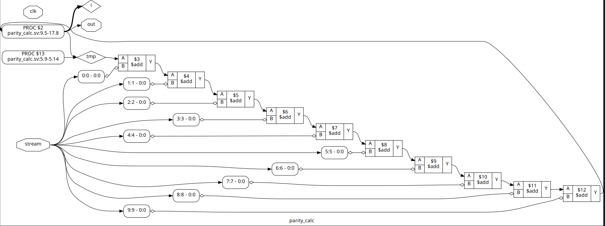
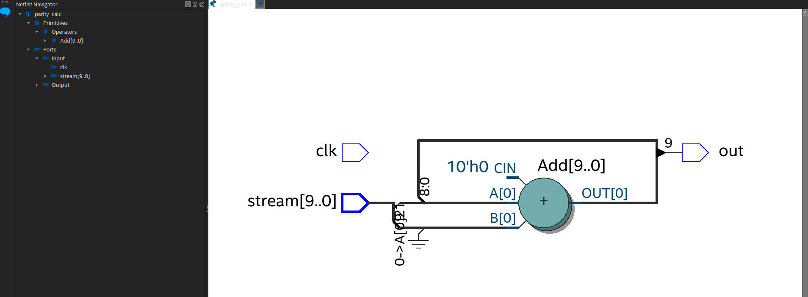

# Parity Check

### Description

- The parity check is a function that takes a list of bits,clk and even or odd parity, and returns a bit.
- The bit indicates whether the list of bits has an even or odd number of 1s.(depending on the parity type).

### Requirements

- Requires python and any verilog simulator,with cocotb package installed.
- Supported verilog simulators: icarus,verilator,modelsim,questa etc.,

``` 
pip3 install cocotb
```
### Test and Verify
You can use any of the simulators available in the market to simulate the parity check.

Run the following shell command to test the parity check:

```
$ iverilog -g2012 -o parity_calc_tb.vvp parity_calc_tb.v
$ vvp parity_calc_tb.vvp
```
This will produce the following output:

```
stream {input stream} out {parity check output}
```

- The design is synthesizable(parity_calc).
- Below is the image of the design after synthesis.




### Applications

- Parity is used in error detection,in the transmission of data,and in the detection of errors in data.
- This can be used in your own applications.

#### Example

```
stream =10'b10101010
parity = parity_check(stream,even)

output = 0

# As the number of 1s in the stream is even,the parity bit will be 0
```

### License

    GNU General Public License v3.0 (GPLv3)
